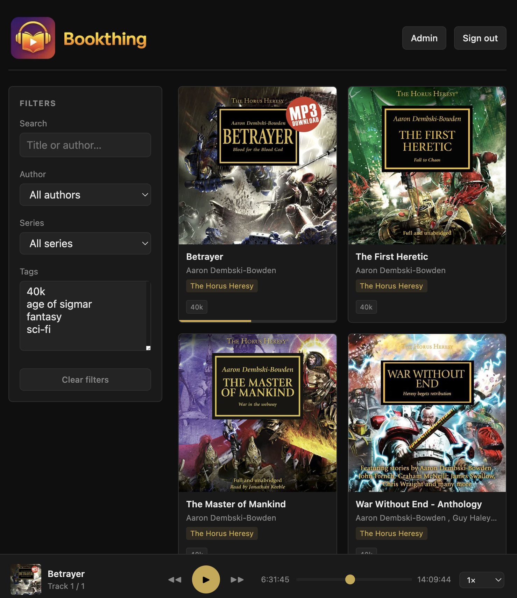

# bookthing

A self-hosted audiobook streaming web app with magic-link authentication. No passwords — users get a login link sent to their email.



## Requirements

- Docker and Docker Compose
- A Gmail account with an [App Password](https://myaccount.google.com/apppasswords) for sending login emails
- A domain with HTTPS (or run locally)
- Your audiobooks somewhere on the host machine

---

## First-time setup

```bash
# 1. Copy the example compose file and fill in your values
cp docker-compose.example.yml docker-compose.yml

# 2. Build and start
docker compose up -d --build

# 3. Scan your library
#    Detects books, reads durations, extracts cover art → data/metadata.json
docker compose exec bookthing python scripts/scan.py
```

On first start, the app emails a login link to `ADMIN_EMAIL`. Check your inbox, click the link, and you're in.

---

## docker-compose.yml settings

| Variable | Description |
|---|---|
| `BASE_URL` | Public URL of your instance (used in login email links) |
| `SESSION_DAYS` | How long login sessions last (default: 30) |
| `SECURE_COOKIES` | Set the `Secure` flag on session cookies (default: `true`). Set to `false` if running without HTTPS (e.g. local development). |
| `ADMIN_EMAIL` | Bootstrapped as admin on first start; receives the first login link |
| `GMAIL_SENDER` | Gmail address used to send login emails |
| `GMAIL_APP_PASSWORD` | Gmail App Password (not your account password) |

The audiobooks volume (`/audiobooks:ro`) should point to wherever your audio files live on the host. The `./data` volume is where the app stores its database, metadata, and uploaded covers — back this up.

---

## Running tests

```bash
# Install test dependencies (one-time)
pip install -r requirements-dev.txt

# Run all tests
pytest tests/ -v
```

Tests use temporary files and an in-memory SQLite database — no running server or real audiobook files needed.

---

## Day-to-day commands

```bash
docker compose up -d          # start in background
docker compose down           # stop
docker compose restart        # restart without rebuilding
docker compose up -d --build  # rebuild after code changes
docker compose logs -f        # view logs
```

---

## Adding users

From the admin page (`/admin`), go to the **Users** section:

1. Add an email address to the allowed list
2. Click **Send login link** — the app emails them a link directly

Users can only log in if their email is on the allowed list. Removing an email from the list doesn't invalidate existing sessions.

---

## Library scanning

The scanner walks your audiobooks directory, detects books, reads audio durations, extracts embedded cover art, and writes `data/metadata.json`.

```bash
docker compose exec bookthing python scripts/scan.py
```

Run the scanner when you add or remove books.

On first run it reads every file's audio duration (can take a minute or two for large libraries). Subsequent scans only re-read files that changed.

**What the scanner preserves:**
- title, author, series, number in series, tags, description, hidden status — anything edited in the admin UI

**What the scanner updates:**
- File list, audio durations, cover art — only if you haven't manually uploaded a cover

---

## Data & persistence

Everything persistent lives in `./data/` (mounted as a Docker volume):

| Path | Contents |
|---|---|
| `data/metadata.json` | All book metadata (titles, authors, tags, descriptions, etc.) |
| `data/covers/` | Uploaded cover images |
| `data/bookthing.db` | Sessions, magic links, and user list |

This directory lives on the host machine — it survives rebuilds, restarts, and image updates. **Back this up.**

The audiobooks themselves are mounted read-only. The app never writes to them.

---

## Updating

```bash
git pull
docker compose up -d --build
```

Your data is untouched. Database schema changes are applied automatically on startup.

---

## Admin page

Visit `/admin` while logged in as an admin. From there you can:

- Edit title, author, series, number in series, tags, and description for any book
- Fetch book descriptions from Google Books
- Upload cover images
- Bulk-edit tags or series across multiple books at once
- Hide books from the library without deleting them
- Delete stale entries left behind after moving files (shown as "missing")
- Filter by missing metadata: no author, no cover, no description, no series, missing files
- Trigger a library scan without shelling into the container
- Manage allowed emails and send login links

Regular users cannot access `/admin`.

---

## Nginx + HTTPS (recommended)

```nginx
server {
    listen 443 ssl;
    server_name bookthing.example.com;

    location / {
        proxy_pass http://127.0.0.1:8000;
        proxy_set_header Host $host;
        proxy_set_header X-Forwarded-Proto $scheme;
        proxy_buffering off;
        # Required for audio streaming
        proxy_http_version 1.1;
    }
}
```

Use Certbot for the SSL certificate:

```bash
certbot --nginx -d bookthing.example.com
```
